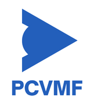

<p align="center"></p>

# PCVMF

PCVMF runs computer vision, controller, and sensor workers in separate Python processes. Application developers install their own plugins and connect workers with YAML. ZeroMQ carries typed JSON messages, while a separate channel supervises startup, progress, and shutdown.

PCVMF 0.3.0 has a breaking API change; see the [0.2 to 0.3 migration guide](docs/how-to/migrate-to-0.3.md). Linux and Python 3.10–3.12 are tested. Scheduling is best-effort, and the publish/subscribe transport does not guarantee message delivery.

## Quick start

You need Linux, Git, Python 3.10–3.12, and `uv`. The demo needs no camera, GPU, or graphical session.

### 1. Download the framework

Open a terminal in the directory where you want to keep the project, then clone the repository and enter it:

```bash
git clone https://github.com/AbdoullahBougataya/PCVMF.git
cd PCVMF
```

Run the remaining commands from this `PCVMF` directory, which contains `pyproject.toml`. If you already cloned the repository, open a terminal in that directory and continue with installation.

### 2. Install the framework

```bash
uv sync --frozen --extra dev
```

This creates `.venv` and installs PCVMF and its development tools. `uv run` uses that environment without activating it.

### 3. Run the built-in demo

```bash
uv run --frozen pcvmf run
```

The demo starts a synthetic vision worker and a controller. Look for these log messages; worker readiness order may vary:

```text
Worker vision ready
Worker controller ready
Application ready: 2 workers
```

The demo is headless and does not print every detection at the default INFO level. Press Ctrl+C to stop it before starting another example.

### 4. Validate and run a configuration

```bash
cp config/default_config.yaml config/my_app.yaml
uv run --frozen pcvmf config validate config/my_app.yaml
uv run --frozen pcvmf run --config config/my_app.yaml
```

Validation prints `Valid configuration: 2 workers`. Edit `config/my_app.yaml` to change workers or plugin options, then validate again. Set `logging.level` to `DEBUG` to see target offsets from the demo controller. See the [configuration reference](docs/reference/configuration.md) for accepted fields and defaults.

### Using pip instead of uv

With Python 3.10–3.12, run these commands from the repository root:

```bash
python3 -m venv .venv
source .venv/bin/activate
python -m pip install -e ".[dev]"
pcvmf run
```

After activation, use `pcvmf ...` wherever the docs show `uv run ... pcvmf ...`. `python -m pcvmf run` also works. Without `--config`, PCVMF loads its packaged demo independently of the checkout.

## Run the external examples

The [vision example](examples/vision.yaml) and [sensor example](examples/sensor.yaml) use plugins from a separate package. Install it once after the quick-start setup:

```bash
uv pip install --python .venv/bin/python --no-deps --editable ./examples/external_plugins
```

Then validate and run either example from the repository root:

```bash
uv run --no-sync pcvmf config validate examples/vision.yaml
uv run --no-sync pcvmf run --config examples/vision.yaml
```

Replace `vision.yaml` with `sensor.yaml` to run the synthetic temperature example. Both need no hardware. Expect `Application ready: 2 workers`; the sensor example also logs a received temperature. Press Ctrl+C to stop. Use `--no-sync` so `uv` preserves the separately installed plugin package. If a later `uv sync` removes it, repeat the installation command. With pip, install it using `python -m pip install --no-deps -e ./examples/external_plugins` and run `pcvmf ...` directly.

## Record a run in MCAP

MCAP recording saves published messages and Python diagnostic logs in one file per run. After installation, try the finite synthetic example:

```bash
uv run --no-sync pcvmf config validate examples/recording.yaml
uv run --no-sync pcvmf run --config examples/recording.yaml
```

The example exits automatically after ten frames and writes a new `.mcap` file under `recordings/`. To enable recording in your own configuration, add `mcap: {}` under `logging`. Recording is disabled when this field is omitted. See the [MCAP logging guide](docs/how-to/mcap-logging.md) to inspect files, choose compression, and handle failures.

## Documentation

The [documentation hub](docs/README.md) lists every guide. Start with the task you want to complete:

| Goal | Guide |
|---|---|
| Build a first application | [Your first application](docs/tutorials/first-application.md) |
| Write and install a vision plugin | [Your first vision plugin](docs/tutorials/vision-plugin.md) |
| Add a sensor and typed message | [Add a sensor and message type](docs/how-to/add-sensor.md) |
| Connect workers and choose options | [Configuration reference](docs/reference/configuration.md) |
| Use a camera, video, or display | [Camera and video guide](docs/how-to/camera-and-video.md) |
| Record messages and diagnostic logs | [MCAP logging guide](docs/how-to/mcap-logging.md) |
| Embed PCVMF in a Python program | [Embedding guide](docs/how-to/embedding.md) |
| Test components without hardware | [Testing guide](docs/how-to/testing.md) |
| Build a wheel or container | [Packaging guide](docs/how-to/packaging.md) |
| Look up Python and wire contracts | [Reference](docs/reference/README.md) |
| Understand delivery and lifecycle | [Explanation](docs/explanation/README.md) |
| Diagnose a failure | [Troubleshooting](docs/how-to/troubleshooting.md) |

Configuration files select executable Python classes. Use configurations and plugins you trust. Plugin imports, validation, and constructors must not acquire devices or other runtime resources; initialization inside a worker owns those resources. For messaging and timing limits, see [delivery and timing](docs/explanation/delivery-and-timing.md).
