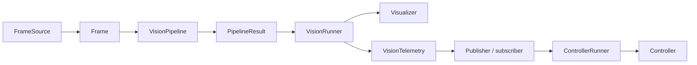

# Architecture and extension boundaries

[Documentation home](../README.md) · [Explanation](README.md)

PCVMF separates an application's algorithms from the machinery that schedules and connects them. A vision algorithm should be usable on a single test frame without starting a camera or a subprocess. A sensor should be addable without editing the supervisor. Those requirements shape the component and worker boundaries.

## Components describe behavior; workers describe execution

A `VisionPipeline` transforms a `Frame` into a `PipelineResult`. It does not decide how frames are captured, how results are serialized, or how often its process runs. A `FrameSource` provides input. A `Visualizer` handles optional display. `VisionRunner` coordinates those components for one cycle, and `VisionWorker` adapts that runner to the process runtime.

Similarly, a `Controller` receives typed messages and performs a periodic tick. `ControllerRunner` handles bounded input batching and tick timing; `ControllerWorker` connects that runner to injected transports.

This layering makes algorithm tests small and repeatable while allowing the deployed application to use separate processes. A custom sensor can implement `Worker` directly when the vision/controller adapters do not match its responsibilities.

## Why separate processes

Independent processes let the operating system schedule vision and control work independently, and they separate Python interpreter state and resource ownership. This is useful when inference or acquisition takes much longer than a controller's normal cycle.

Process separation is not a promise of dedicated CPU cores or deterministic latency. Workers still compete for CPU, memory bandwidth, devices, and other shared system resources. Native libraries may use threads internally. IPC and serialization add overhead. The benefit here is an explicit scheduling and failure boundary, not an unconditional performance gain.

The runtime uses multiprocessing's `spawn` context. A fresh child imports code and initializes its own resources rather than inheriting a running model, device handle, or ZeroMQ context. This is why plugin classes need importable modules and why resources must not be acquired at import time.

## Configuration is the composition boundary

An application installs its own package and selects `module:Class` paths in YAML. Shared loading and validation check contract compatibility; no central list of application classes needs editing inside PCVMF.

Framework fields describe execution: names, routes, rates, endpoints, and timeouts. Plugin options describe domain behavior: detector thresholds, model settings, or device parameters. This division prevents a generic supervisor from needing to understand every sensor's settings.

Validation imports plugins but does not prove that their external resources are available. The distinction is deliberate: a configuration can be structurally correct even when a camera is disconnected. Initialization failures belong to the runtime and are reported with the responsible worker.

## Resource ownership follows process ownership

The parent owns process supervision and run-level temporary resources. Each child owns its plugin instances, devices, models, and transports. Cleanup moves outward: component cleanup first, then framework transports, then parent-side process and endpoint cleanup.

The subscriber and publisher interfaces also serve as test seams. A collector can replace a publisher in a synchronous test, while production uses ZeroMQ. This does not mean arbitrary replacement transports are configurable through YAML today; the runtime currently constructs its built-in ZeroMQ adapters.

## One endpoint per publisher

A publication is a logical topic, not a socket to bind. Each publisher worker owns one endpoint and can publish multiple topics. A subscriber can connect to multiple publishers and distinguish messages by source and topic.

This avoids multiple workers trying to own the same IPC path. It also makes concurrent application instances practical: default paths belong to unique per-run directories. A central broker is not required for the current topology, but there is no distributed discovery, durable routing, or remote endpoint configuration in this version.

## Public boundaries and evolution

The public contracts describe what application plugins need to implement; built-in component paths provide useful defaults. Configuration loading, application execution, and single-step runners are documented application APIs. Internal transport and registry classes are implementation details.

Versioned codecs keep message interpretation explicit. The framework does not silently convert an older schema into a newer one. A breaking application change requires coordinated configuration, code, and schema updates. See [messages](../reference/messages.md) for the exact boundary and [migration](../how-to/migrate-to-0.3.md) for the 0.3 transition.
