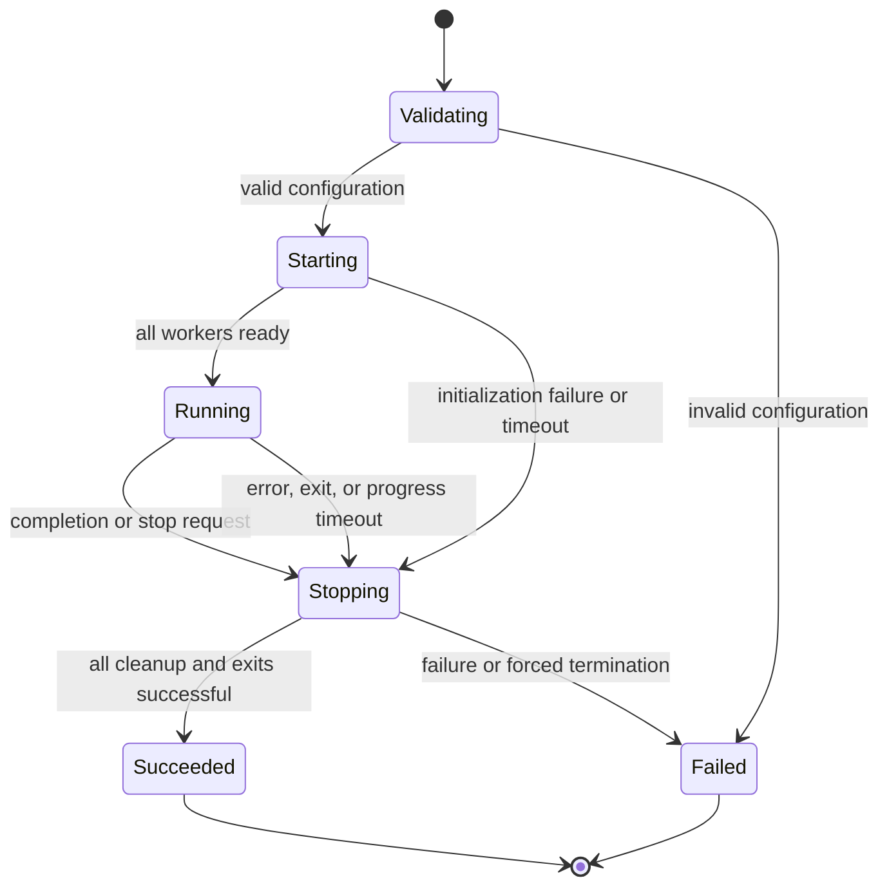

# Lifecycle and failure policy

[Documentation home](../README.md) · [Explanation](README.md)

PCVMF treats a configured application as one supervised unit. Every worker is required. The initial policy is deliberately fail-fast: if a required worker fails, the application stops instead of silently continuing with a partial system.

## Initialization and readiness

The parent validates configuration before launching children. Each child creates its own transports, constructs its worker, and initializes resources. It reports readiness over a control pipe and waits at a shared execution gate. The parent opens that gate only when all workers are ready.

Readiness means initialization finished; it does not mean a subscriber has already received data. Startup timeouts include interpreter startup and initialization. Slow but bounded model loading needs a suitable startup allowance. Infinite waits during initialization remain a failure.

## Progress must come from useful execution

Workers report progress from their execution loop. A separate heartbeat thread could continue reporting life while the actual inference or device call is stuck; PCVMF avoids that misleading signal. A blocked step therefore stops heartbeats and eventually exceeds `progress_timeout`.

A legitimate long step and a stuck step look the same to the supervisor until the call returns. The application must choose a timeout that allows expected work while still detecting an unacceptable stall. Device-level bounded I/O is preferable to relying only on forced process termination.

## Normal completion is application-wide

A finite video or synthetic stream ends normally. So does a worker returning `False`, a controller returning `False` from `tick()`, or a requested CLI shutdown. Any of these causes all workers to stop.

This supports coordinated experiments and batch runs: a finite source can finish the whole application. It also means a plugin must not return `False` merely because it has no new data on one iteration. Temporary source unavailability is represented explicitly by `ReadStatus.UNAVAILABLE`.

## Cleanup can fail independently of the main work

A computation may finish successfully while hardware release or another cleanup operation fails. Reporting success in that case would hide an incomplete shutdown. PCVMF therefore considers cleanup errors, missing cleanup acknowledgement, abnormal exit codes, and forced termination unsuccessful.

Plugins must handle partial initialization. If the camera opens and model loading fails, camera release is still necessary. Cleanup should also attempt later releases even if an earlier one fails. Framework runners apply this policy to their components, and the runtime applies it to worker and transport cleanup.

The parent waits for graceful exit up to each worker's allowance, then uses terminate and finally kill with bounded waits. Forced termination cannot execute arbitrary cleanup reliably. The parent can clean owned IPC paths using recorded file identities, but it cannot undo every device-side effect. This is why bounded, cooperative cleanup remains important.

## Why there is no automatic restart

Restarting a worker can change sequence numbering, lose controller state, reacquire a device, and reconnect a subscriber while messages are in flight. A safe recovery policy depends on the application. Automatically restarting only the failed process would imply guarantees that the framework does not currently provide.

Version 0.3 instead reports failure and stops the unit. An embedding application or deployment system can choose whether and when to launch a fresh application, using a new `Application` instance and its own recovery policy.

## Signal handling belongs to the entry point

The CLI translates SIGINT and SIGTERM into a stop request. The embeddable runner does not install OS handlers, so it can coexist with an application's own event loop and signal policy. Stop requests are deferred into supervision rather than acquiring multiprocessing synchronization locks inside a signal handler.

For a concrete integration, see [embed and stop an application](../how-to/embedding.md). For observable events and exit codes, see [CLI and diagnostics](../reference/cli.md).
